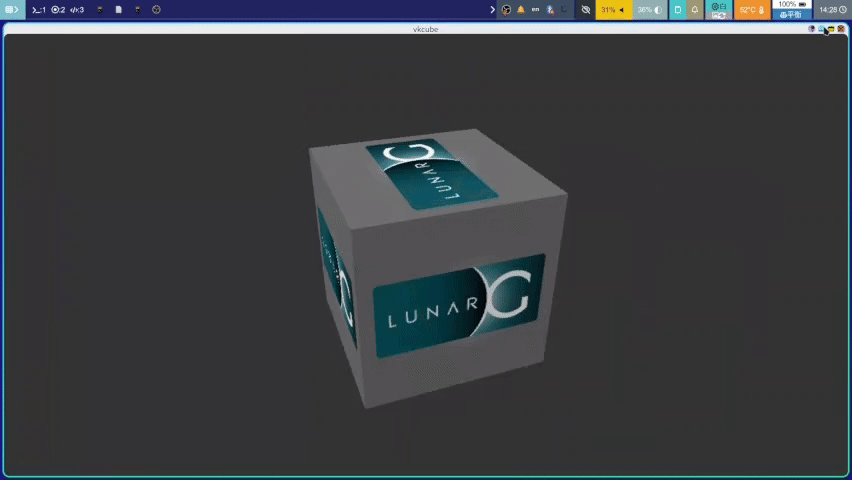

## Scripts for hyprland

### hypr-minimize.sh
> note: jq and wofi are needed

A shell script used to minimize or recover a window.

Usage: hypr-minimize.sh \<options\> can be

`-m` minimize an activity window. 

`-r` open a wofi dmenu for choose window which should be recovered. 

`-g` get window count of special workspace.

### HyprMinimizeHelper

It is used to handle minimize event and window activity event whith is emitted by status bar application (e.g. waybar).

Usage: should be start when hyprland started. e.g. `exec-once = ~/.config/hypr/scripts/HyprMinimizeHelper.sh`

### HyprFloatMode.sh

A simple shell script to toggle window rule of hyprland.

### window-selector.sh

It is used to switch window in a workspace or select window which should been activity.

Usage: window-selector.sh \<option\> 

option: `-switch` Switch window in current workspace.

`-select` Open wofi dmenu for select window.

### hypr-minimize.sh
> 注意：需要 jq 与 wofi

用于最小化或还原最小化窗口的 shell 脚本。

使用：hypr-minimize.sh \<options\> 

选项
-m 最小化一个活动窗口。

-r 打开 wofi dmenu 以选择要恢复的窗口

-g 获取特殊工作区的窗口数量。

### HyprMinimizeHelper

用于处理被状态栏应用（例如 waybar）发出的最小化事件或窗口活动事件。

使用：应该在 hyprland 启动后启动，例如：`exec-once = ~/.config/hypr/scripts/HyprMinimizeHelper.sh`

### HyprFloatMode.sh

用于在 hyprland 中临时切换到 shell脚本。

### window-selector.sh

用于切换窗口的 Shell 脚本,使用方法：window-selector.sh \<option\> 

选项：`-switch` 在当前工作区切换窗口

`-select` 打开 wofi dmenu 界面选择窗口
