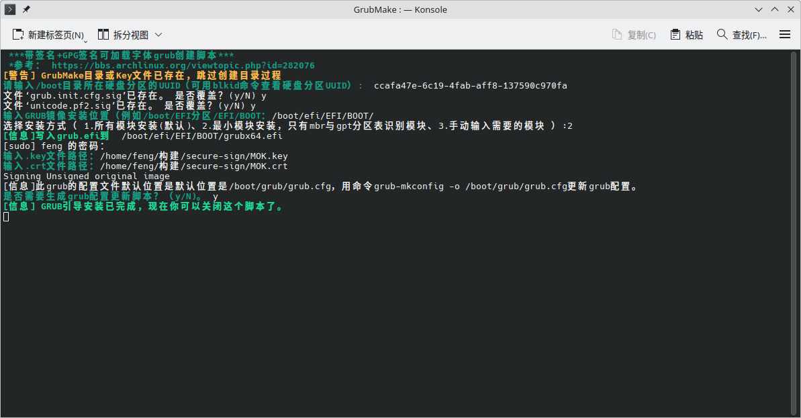
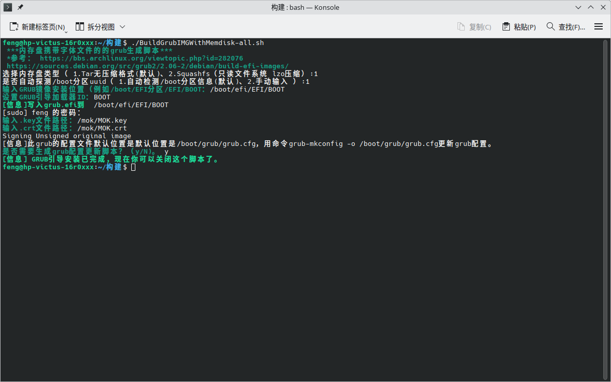
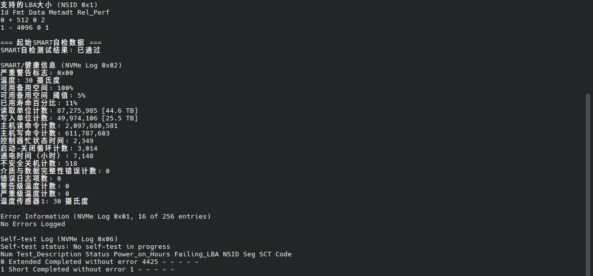

## Simple script tool

English (this one) | 中文（[简体](tools_zh.md)）

Some simple shell script for easier operation.

#### Used for grub secure boot

* [CreateSignedGrub2.sh](#createsignedgrub2sh) —— gpg signature workaround + generate signal grub efi image (Can work on arch linux with shim-signed)
* [BuildGrubIMGWithMemdisk-all.sh](#buildgrubimgwithmemdisk-allsh) —— Generate grub image with memdisk including font file. To solve grub font load problem. (e.g. enable secure boot on arch linux)
  
## CreateSignedGrub2.sh

## BuildGrubIMGWithMemdisk-all.sh

Create grub efi image including memdisk whith contained font file for loading font in secure boot case. Thanks [AzureZeng](https://space.bilibili.com/156006579) for [workaround](https://www.bilibili.com/video/BV1PCzNYtE4G) support.

## TranslatesSMARTinfo.sh
Translate english to chinese.

